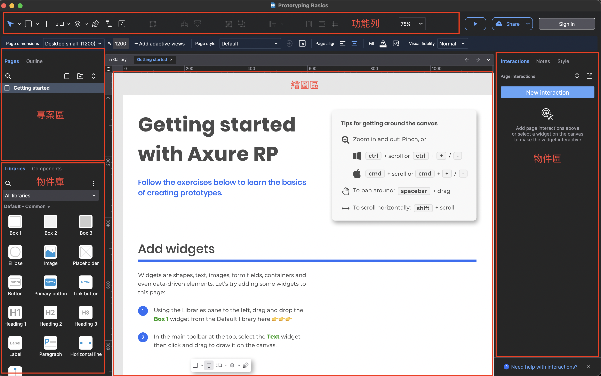

> Axure RP：全球最受歡迎的介面原型設計工具：專為數位產品相關從業人員量身打造，適合 UX 設計師、產品經理、網站企劃人員及系統分析師使用。以更快速、更直觀的方式，輕鬆製作各種線框圖（Wireframe）、流程圖、互動原型（Prototype），以及預先格式化的 Word 文件，完全免除撰寫程式碼的繁瑣步驟。

# 前言
本文透過學習悠識學院 Axure RP 10 基礎操作教學課程，建立 Axure 學習筆記，幫助讀者學習這個介面原型設計工具，快速進入 Axure 世界。近一步打造自己的線框圖（Wireframe）、流程圖和互動原型（Prototype）。

# 重點筆記
第一章 簡介
1-1 Axure RP 10 簡介

Axure RP 主要有幾個常用的功能區塊：
1. 物件庫
可以選擇欲新增的物件，例如：圖片、圖案、icon、文字和線條等，亦可以從外部引入物件。
2. 專案區
可以編輯和設定專案的資料夾和層級。
3. 功能列
透過功能列設定，可以設定選擇工具、文字方塊。
4. 物件區
當無指定物件時主要是編輯文件屬性，當指定物件時編輯物件屬性。
5. 繪圖區
主要繪圖和操作地方，任何物件的繪製皆是在繪圖區。

第二章 物件（Widget）
物件是我們繪製線框圖最小單位：文字、圖案、下拉選單等。

2-1 物件介紹
物件的基本設定
我們可以在編輯區點選任何一個物件，物件區會顯示該物件在樣式上的相關屬性內容，可以直接進行修改和編輯。

物件樣式管理
物件樣式管理讓我們可以預先統一規範物件中預設的樣式。

物件的操作
透過操作功能，可以輕鬆整理和管理物件。

暸解如何擴充物件庫
物件庫中除了原有既有 Axure 所提供的物件外，我們還可以從網路上下載擴充物件庫：
上網下載檔案並載入
Browse Libraries... > Add Local Library

第三章 基礎互動設計
3-1 基礎互動：簡介
3-2 基礎互動：點選後開啟連結
3-3 基礎互動：點選後改變能見度
3-4 基礎互動：滑鼠移至樣式改變

第四章 頁面設定與網站地圖
4-1 頁面設定與網站地圖

第五章 流程圖（Flow）
5-1 流程圖（Flow）

第六章 共用區塊（Components）
6-1 共用區塊（Components）

第七章 基礎動態面板（Dynamic Panel）
7-1 基礎動態面板（Dynamic Panel）

第八章 進階動態面板（Dynamic Panel）
8-1 進階動態版面：旋轉木馬（Carousel）
8-2 進階動態面板：Mega Menu

第九章 預覽（Preview）、發佈（Publish）
9-1 預覽與發佈

第十章 規格文件（Specification）
10-1 規格文件（Specification）

# 實務範例
範例(1): 設計網站地圖
你是一個二手書電商網站 PM 請使用 Xmind 設計一個網站地圖
• 首頁
• 書籍分類列表
• 關鍵字查詢清單列表
• 百大好書排行榜
• 產品內容資訊詳細頁

範例(2): 製作網站原型 Mockup 視覺稿
請用 Axure 製作二手書電商網站設計 Mockup 視覺稿
• Logo (網站名稱)：於導覽列左側的地方放置網站 Logo
• 搜尋框：讓使用者可以輸入關鍵字搜尋相關商品
• 主打輪播圖：用 3 張張大圖呈現網站重點的銷售商品
• 推薦商品：用各 8 張小圖，排列 2 個不同主題商品
• 客戶評價：呈現 6 則已購客戶的好評推薦,增強信任感
• 購物車：請在網頁的右下角，連結可快速前往結帳

# 總結
